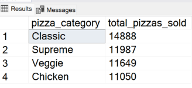
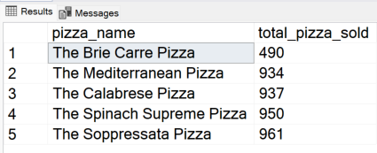
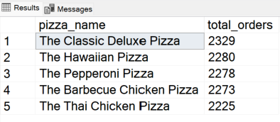
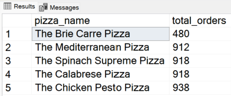

 
<h1>Pizza Sales Analysis Project</h1>

  

----

__Tools used : Excel, MS SQL Server, Tableau, Power BI__

Dashboard: 

__Business Problem Scenario__
-------
A Pizza shop is facing a business challenge in understanding customer preferences and optimizing their menu. The management team at PizzaPalace has realized the potential of data analytics in gaining insights into customer behavior and enhancing their offerings. They want to utilize data analytics to improve overall business performance and identify their best-selling pizza to focus on marketing and promotion efforts.

__Solution Plan__
-------
  + To help address the operational challenges faced by the business, I will utilize SQL to perform data wrangling and extract key performance metrics(KPI) from their sales data csv file. Leveraging on SQL functions, I can uncover crucial KPIs such as hourly and weekly trend for total pizza orders, percentage sales by pizza category and size as well as identifying the best and worst selling menu items. Data cleaning, data transformation and analysis will be performed.
  + After extracting the KPIs, I will leverage on Microsoft Power BI/Tableau to present the findings. The goal is to create interactive and dynamic dashboards which showcases sales trends, order patterns and menu performnace through relevant graphs and charts. This will allow the stakeholders of the pizza company to gain actionable insights, facilitating strategic decisions to enhance operations and overall profitability of the business.

__Conclusion__
---------

By doing a comprehensive analysis on the pizza sales dataset, a comprehensive understanding of consumer behavior and prevailing market trends has been achieved. The analysis unveiled crucial insights, notably identifying peak and off-peak periods based on hourly,daily and monthly order trends. With this knowledge the businesses will be abple to stratgically optimize staffing and inventory management, aligning resources with varying demand levels effectively. Furthermore, the examination of sales distribution across different pizza categories shed light on customer preferences, providing valuable input for menu refinement and targeted marketing strategies to elevate sales performance.

Additionally, the calculation of the average number of pizzas sold per order provided key insights into consumer behavior and consumption patterns. This enables the business to tailor pricing strategies and portion sizes to maximize profitability while ensuring customer satisfaction. Overall, this comprehensive analysis serves as a catalyst for data-driven decision-making, enabling the pizza establishment to fine-tune operations and elevate the overall customer experience. These strategic moves are pivotal for sustained success in the competitive pizza market.

__Execution__
---------

__Questions Answered from the Dataset__

__1) What are the Key Performance Indicators obtained from the Dataset?__

+ __Total Revenue:__
  
      SELECT CAST(SUM(total_price) AS DECIMAL(10,2))
      AS total_revenue
      FROM pizza_sales;
   

This metric serves as a key indicator of the business's financial health and performance, directly reflecting its ability to generate income from its operations.
      
+ __Average Order Value:__
    
        SELECT CAST(CAST(SUM(total_price) AS DECIMAL(10,2)) / 
        CAST(COUNT(DISTINCT order_id) AS DECIMAL(10,2)) AS DECIMAL(10,2))
        AS avg_order_value
        FROM pizza_sales
    

The average order value is valuable for gaining insights into consumer spending patterns and evaluating the efficacy of marketing approaches. A high average order value signifies that consumers are spending more per transaction potentially leading to increased revenue and profitability.

+ __Total Pizzas Sold:__
    
        SELECT SUM(quantity) 
        AS total_pizza_sold
        FROM pizza_sales;
     

![image]
    
Total pizzas sold is a fundamental metric that reflects product demand. It provides insights into consumption patterns and aids in inventory management and production planning. By understanding total pizzas sold, it allows businesses to better meet consumer demand.
    
+ __Total Orders:__
    
        SELECT COUNT(DISTINCT order_id) 
        AS total_orders
        FROM pizza_sales;
     

Total orders represent the volume of transactions processed within a specific period. Tracking total orders helps in evaluating sales performance and 
identifying trends in consumer behavior. It provides a basis for assessing business growth and operational efficiency.

+ __Average Pizzas Per Order:__
    
        SELECT CAST(CAST(SUM(quantity) AS DECIMAL(10,2)) / 
        CAST(COUNT(DISTINCT order_id) AS DECIMAL(10,2)) AS DECIMAL(10,2))
        AS avg_pizzas_per_order
        FROM pizza_sales
        

Average pizzas per order indicates the average quantity of pizzas purchased during each transaction. This metric offers insights into customer preferences and 
ordering behavior. Higher average pizzas per order may indicate upselling opportunities or popular menu items.
    
__2)  Monthly Trend for Orders__

        SELECT DATENAME(MONTH, order_date) AS month_name, COUNT(DISTINCT order_id) AS total_orders
        FROM pizza_sales
        GROUP BY DATENAME(MONTH, order_date);

        

By analyzing the monthly trend of total orders over the year, we can identify patterns and fluctuations in order volumes on a monthly basis. This 
helps in understanding the demand patterns throughout the month, enabling better inventory management and resource allocation.

 __3) Daily Trend for Total Orders__

        SELECT DATENAME(DW, order_date) as Order_Day, COUNT(DISTINCT order_id) AS total_orders
        FROM pizza_sales
        GROUP BY DATENAME(DW,order_date);

The chart illustrating the daily trend of total orders provide insights into the overall order activity for each day. Identifying peak periods of high order activity can aid in resource allocation, production planning, and promotional efforts. By recognizing daily trends, businesses can adjust their operations to capitalize on high-demand periods and optimize efficiency during slower periods.

__4) Hourly Trend for Total Orders__

        SELECT DATEPART(HOUR, order_time) AS order_Hours, COUNT (DISTINCT order_id) AS total_orders 
        FROM pizza_sales
        GROUP BY DATEPART(HOUR, order_time)
        ORDER BY DATEPART(HOUR, order_time);
        

The chart showcasing the hourly trend of total orders provides a more indepth breakdown into the overall daily order activities. Identifying peak periods of high order activity can aid in manpower allocation to maximise effeciency or the optimal time to introduce limited promotional discount to boost sales.

__5) Percentage of Sales by Pizza Category__

        SELECT pizza_category, CAST(SUM(total_price) AS DECIMAL(10,2)) AS total_sales, CAST(SUM(total_price)*100/
        (SELECT SUM(total_price) FROM pizza_sales WHERE MONTH(order_date) = 1) AS DECIMAL(10,2)) AS percentage_total_sales
        FROM pizza_sales
        WHERE MONTH(order_date) = 1
        GROUP BY pizza_category;

Analyzing the sales distribution among various pizza categories provides valuable insights into the popularity of each category and its impact on overall sales, empowering the business to make informed decisions on menu optimization, marketing strategies, and inventory management. This strategic approach aims to maximize revenue and enhance consumer satisfaction.

 __6) Percentage of Sales by Pizza Size__

        SELECT pizza_size, CAST(SUM(total_price) AS DECIMAL(10,2))AS total_sales, CAST(SUM(total_price)*100/
        (SELECT SUM(total_price) FROM pizza_sales) AS DECIMAL(10,2))AS percentage_total_sales
        FROM pizza_sales as total_Sales
        GROUP BY pizza_size
        ORDER BY Percentage_Total_Sales DESC;

The chart illustrating the percentage of sales attributed to different pizza sizes provides insights into consumer preferences regarding pizza size. 
Understanding these preferences allows for better inventory management and menu optimization to meet consumer demand effectively.

__7) Total Pizzas Sold by Pizza Category__

        SELECT pizza_category, sum(quantity) as Total_Pizzas_Sold 
        FROM pizza_sales
        GROUP BY pizza_category
        ORDER BY Total_Pizzas_Sold DESC;

The chart depicting the total number of pizzas sold for each pizza category enables comparison of sales performance across different categories. This 
visualization helps in identifying popular and less popular pizza options, informing marketing strategies and menu adjustments accordingly.

__8) Top 5 Pizzas by Revenue__

        SELECT TOP 5 pizza_name, SUM(total_price) AS Total_Revenue
        FROM pizza_sales
        GROUP BY pizza_name 
        ORDER BY Total_Revenue DESC;

        

Examining the top pizzas by revenue is crucial for understanding the financial performance of each pizza category. It considers not just popularity but also the revenue generated by each pizza. This metric helps businesses focus on pizzas that contribute the most to the bottom line, allowing for strategic pricing and inventory decisions to maximize profitability.

 __9) Bottom 5 Pizzas by Revenue__

        SELECT TOP 5 pizza_name, CAST(SUM(total_price) AS DECIMAL(10,2)) AS Total_Revenue
        FROM pizza_sales
        GROUP BY pizza_name 
        ORDER BY Total_Revenue ASC;

Conversely, examining the bottom 5 pizzas by revenue highlights products that contribute less to overall financial performance. It allows businesses to assess the profitability of each pizza, informing decisions on pricing adjustments or promotional strategies to boost sales.

 
__10) Top 5 Pizzas by Quantity__

        SELECT TOP 5 pizza_name, SUM(quantity) AS Total_Pizza_Sold 
        FROM pizza_sales
        GROUP BY pizza_name
        ORDER BY SUM(quantity) DESC;

Identifying the top pizzas by quantity provides insights into the overall popularity of specific pizzas across all orders, helping businesses understand which pizzas are frequently chosen. It informs marketing strategies by highlighting which pizzas can be emphasized in promotions or special offers to capitalize on their popularity.

 
__11) Bottom 5 Pizzas by Quantity__

        SELECT TOP 5 pizza_name, SUM(quantity) AS Total_Pizza_Sold 
        FROM pizza_sales
        GROUP BY pizza_name
        ORDER BY SUM(quantity) ASC;

Conversely, identifying the bottom 5 worst-selling pizzas based on quantity indicates potential areas for improvement or innovation to enhance customer appeal. Understanding low-performing pizzas assists in optimizing inventory levels, reducing the risk of overstocking unpopular items.
  
__12) Top 5 Pizzas by Total Orders__

        SELECT TOP 5 pizza_name, COUNT(DISTINCT order_id) AS Total_Orders
        FROM pizza_sales
        GROUP BY pizza_name
        ORDER BY Total_Orders DESC;

Analyzing the top pizzas by customer ID helps in recognizing the pizzas that are frequently ordered by a significant number of customers, indicating popular choices.
Businesses can use this information to tailor marketing efforts, providing personalized recommendations or promotions based on individual customer preferences.

 __13) Bottom 5 Pizzas by Total Orders__

        SELECT TOP 5 pizza_name, COUNT(DISTINCT order_id) AS Total_Orders
        FROM pizza_sales
        GROUP BY pizza_name
        ORDER BY Total_Orders ASC;

Analyzing the bottom pizzas by customer ID reveals the pizzas that are ordered less frequently, offering insights into less popular choices among customers. Understanding less preferred pizzas can guide businesses in adjusting their menu, introducing new options, or improving existing recipes to better meet customer expectations.
