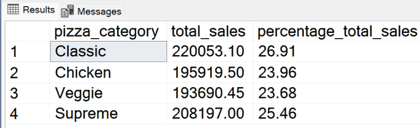

 
<h1>Pizza Sales Analysis Project</h1>

  

----

__Tools used : Excel, MS SQL Server, Tableau, Power BI__

__Business Problem Scenario__
-------
A Pizza shop is facing a business challenge in understanding customer preferences and optimizing their menu. The management team at PizzaPalace has realized the potential of data analytics in gaining insights into customer behavior and enhancing their offerings. They want to utilize data analytics to improve overall business performance and identify their best-selling pizza to focus on marketing and promotion efforts.

__Solution Plan__
-------
  + To help address the operational challenges faced by the business, I will utilize SQL to perform data wrangling and extract key performance metrics(KPI) from their sales data csv file. Leveraging on SQL functions, I can uncover crucial KPIs such as hourly and weekly trend for total pizza orders, percentage sales by pizza category and size as well as identifying the best and worst selling menu items. Data cleaning, data transformation and analysis will be performed.
  + After extracting the KPIs, I will leverage on Microsoft Power BI/Tableau to present the findings. The goal is to create interactive and dynamic dashboards which showcases sales trends, order patterns and menu performnace through relevant graphs and charts. This will allow the stakeholders of the pizza company to gain actionable insights, facilitating strategic decisions to enhance operations and overall profitability of the business.

__Execution__
---------

__Questions Answered from the Dataset__

__1) What are the Key Performance Indicators obtained from the Dataset?__

+ __Total Revenue:__
  
      SELECT CAST(SUM(total_price) AS DECIMAL(10,2))
      AS total_revenue
      FROM pizza_sales;
   

This metric provides a clear measure of the overall financial performance of pizza sales. It indicates the total amount of money generated from pizza 
orders over a specific period, reflecting the revenue potential of your
      
+ __Average Order Value:__
    
        SELECT CAST(CAST(SUM(total_price) AS DECIMAL(10,2)) / 
        CAST(COUNT(DISTINCT order_id) AS DECIMAL(10,2)) AS DECIMAL(10,2))
        AS avg_order_value
        FROM pizza_sales
    

Average order value helps in understanding customer spending habits and the effectiveness of marketing strategies. A higher average order value indicates that 
customers are spending more per transaction, which can contribute to increased revenue and profitability.

+ __Total Pizzas Sold:__
    
        SELECT SUM(quantity) 
        AS total_pizza_sold
        FROM pizza_sales;
     

![image]
    
Total pizzas sold is a fundamental metric that directly reflects product demand. It provides insights into consumption patterns and helps in inventory management and production planning. Understanding total pizzas sold enables businesses to meet customer demand efficiently.
    
+ __Total Orders:__
    
        SELECT COUNT(DISTINCT order_id) 
        AS total_orders
        FROM pizza_sales;
     

Total orders represent the volume of transactions processed within a specific period. Tracking total orders helps in evaluating sales performance and 
identifying trends in customer behavior. It provides a basis for assessing business growth and operational efficiency.

+ __Average Pizzas Per Order:__
    
        SELECT CAST(CAST(SUM(quantity) AS DECIMAL(10,2)) / 
        CAST(COUNT(DISTINCT order_id) AS DECIMAL(10,2)) AS DECIMAL(10,2))
        AS avg_pizzas_per_order
        FROM pizza_sales
        

Average pizzas per order indicates the average quantity of pizzas purchased in each transaction. This metric offers insights into customer preferences and 
ordering behavior. Higher average pizzas per order may indicate upselling opportunities or popular menu items.
    
__2)  Monthly Trend for Orders__

        SELECT DATENAME(MONTH, order_date) AS month_name, COUNT(DISTINCT order_id) AS total_orders
        FROM pizza_sales
        GROUP BY DATENAME(MONTH, order_date);

        

By analyzing the daily trend of total orders over a specific time period, we can identify patterns and fluctuations in order volumes on a daily basis. This 
helps in understanding the demand patterns throughout the week or month, enabling better inventory management and resource allocation.

 __3) Daily Trend for Total Orders__

        SELECT DATENAME(DW, order_date) as Order_Day, COUNT(DISTINCT order_id) AS Total_Orders
        FROM pizza_sales
        GROUP BY DATENAME(DW,order_date);

The chart illustrating the monthly trend of total orders offers insights into the overall order activity throughout the month. Identifying peak periods of high order activity can aid in resource allocation, production planning, and promotional efforts. By recognizing monthly trends, businesses can adjust their operations to capitalize on high-demand periods and optimize efficiency during slower periods.

__4) Hourly Trend for Total Orders__

        SELECT DATEPART(HOUR, order_time) AS Order_Hours, COUNT (DISTINCT order_id) AS Total_Orders 
        FROM pizza_sales
        GROUP BY DATEPART(HOUR, order_time)
        ORDER BY DATEPART(HOUR, order_time);
        

__5) Percentage of Sales by Pizza Category__

        SELECT pizza_category, CAST(SUM(total_price) AS DECIMAL(10,2)) AS total_sales, CAST(SUM(total_price)*100/
        (SELECT SUM(total_price) FROM pizza_sales WHERE MONTH(order_date) = 1) AS DECIMAL(10,2)) AS percentage_total_sales
        FROM pizza_sales as total_sales
        WHERE MONTH(order_date) = 1
        GROUP BY pizza_category;

The distribution of sales across different pizza categories helps in understanding the popularity of each category and its contribution to overall sales. This 
insight informs menu optimization strategies, marketing campaigns, and inventory management decisions to maximize revenue and customer satisfaction.

 __6) Percentage of Sales by Pizza Size__

        SELECT pizza_size AS Pizza_Size, CAST(SUM(total_price) AS DECIMAL(10,2))AS Total_Sales, CAST(SUM(total_price)*100/
        (SELECT SUM(total_price) FROM pizza_sales) AS DECIMAL(10,2))AS Percentage_Total_Sales
        FROM pizza_sales as Total_Sales
        GROUP BY pizza_size
        ORDER BY Percentage_Total_Sales DESC;

The chart depicting the percentage of sales attributed to different pizza sizes provides insights into customer preferences regarding pizza size. 
Understanding these preferences allows for better inventory management and menu optimization to meet customer demand effectively.

__7) Total Pizzas Sold by Pizza Category__

        SELECT pizza_category, sum(quantity) as Total_Pizzas_Sold 
        FROM pizza_sales
        GROUP BY pizza_category
        ORDER BY Total_Pizzas_Sold DESC;

The chart illustrating the total number of pizzas sold for each pizza category enables comparison of sales performance across different categories. This 
visualization helps in identifying popular and less popular pizza options, informing marketing strategies and menu adjustments accordingly.

__8) Top 5 Pizzas by Revenue__

        SELECT TOP 5 pizza_name, SUM(total_price) AS Total_Revenue
        FROM pizza_sales
        GROUP BY pizza_name 
        ORDER BY Total_Revenue DESC;

        

The chart highlighting the top 5 best-selling pizzas based on revenue, total quantity, and total orders identifies the most popular pizza options. This 
insight aids in understanding customer preferences and allows for targeted promotions or menu enhancements to capitalize on high-demand items.

 __9) Bottom 5 Pizzas by Revenue__

        SELECT TOP 5 pizza_name, CAST(SUM(total_price) AS DECIMAL(10,2)) AS Total_Revenue
        FROM pizza_sales
        GROUP BY pizza_name 
        ORDER BY Total_Revenue ASC;

Conversely, the chart showcasing the bottom 5 worst-selling pizzas based on revenue, total quantity, and total orders helps identify underperforming or less 
popular pizza options. This information is valuable for making strategic decisions such as discontinuing unpopular items or adjusting pricing and marketing 
strategies to boost sales.
 
__10) Top 5 Pizzas by Quantity__

        SELECT TOP 5 pizza_name, SUM(quantity) AS Total_Pizza_Sold 
        FROM pizza_sales
        GROUP BY pizza_name
        ORDER BY SUM(quantity) DESC;

Identifying the top 5 pizzas by quantity sold provides insight into the most popular pizza varieties among customers. This information helps in understanding 
customer preferences and allows for targeted marketing efforts or menu optimizations to capitalize on high-demand items.
 
__11) Bottom 5 Pizzas by Quantity__

        SELECT TOP 5 pizza_name, SUM(quantity) AS Total_Pizza_Sold 
        FROM pizza_sales
        GROUP BY pizza_name
        ORDER BY SUM(quantity) ASC;

Conversely, identifying the bottom 5 pizzas by quantity sold highlights less popular or underperforming pizza options. This insight can inform menu 
adjustments, promotional strategies, or inventory management decisions to minimize waste and maximize profitability.
  
__12) Top 5 Pizzas by Total Orders__

        SELECT TOP 5 pizza_name, COUNT(DISTINCT order_id) AS Total_Orders
        FROM pizza_sales
        GROUP BY pizza_name
        ORDER BY Total_Orders DESC;

Identifying the top 5 pizzas by total orders sheds light on the most frequently ordered pizza varieties. This information helps in understanding customer 
behavior and preferences, enabling businesses to tailor marketing campaigns and menu offerings to meet customer demand effectively.

 __13) Bottom 5 Pizzas by Total Orders__

        SELECT TOP 5 pizza_name, COUNT(DISTINCT order_id) AS Total_Orders
        FROM pizza_sales
        GROUP BY pizza_name
        ORDER BY Total_Orders ASC;

Identifying the bottom 5 pizzas by total orders reveals less popular or niche pizza options that may require attention or adjustments. Understanding these trends allows businesses to make informed decisions regarding menu adjustments, promotional strategies, or inventory management to optimize sales and customer satisfaction.

__Conclusion__
---------

By doing a comprehensive analysis on the pizza sales dataset, a comprehensive understanding of consumer behavior and prevailing market trends has been achieved. The analysis unveiled crucial insights, notably identifying peak and off-peak periods based on hourly,daily and monthly order trends. With this knowledge the businesses will be abple to stratgically optimize staffing and inventory management, aligning resources with varying demand levels effectively. Furthermore, the examination of sales distribution across different pizza categories shed light on customer preferences, providing valuable input for menu refinement and targeted marketing strategies to elevate sales performance.

Additionally, the calculation of the average number of pizzas sold per order provided key insights into consumer behavior and consumption patterns. This enables the business to tailor pricing strategies and portion sizes to maximize profitability while ensuring customer satisfaction. Overall, this comprehensive analysis serves as a catalyst for data-driven decision-making, enabling the pizza establishment to fine-tune operations and elevate the overall customer experience. These strategic moves are pivotal for sustained success in the competitive pizza market.
